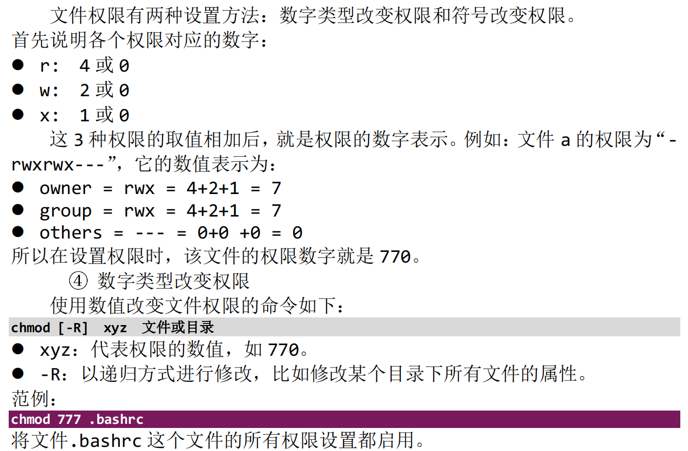

- [【第2篇】Linux基本操作](#第2篇linux基本操作)
  - [1. Ubuntu 和 Windows 的简单比较与使用](#1-ubuntu-和-windows-的简单比较与使用)
    - [**挂载**](#挂载)
    - [**何为挂载？**](#何为挂载)
    - [**`disks`**](#disks)
    - [将`/dev/sda1`挂载在`/home`下 在`/home`下新建1.txt ，然后将`/dev/sda4` 挂载在`/home`下 此时`1.txt`是一个什么状态 是否还能访问](#将devsda1挂载在home下-在home下新建1txt-然后将devsda4-挂载在home下-此时1txt是一个什么状态-是否还能访问)
    - [**如果你想要访问 `1.txt` 文件，你需要通过挂载 `/dev/sda1` 分区的其他目录来进行**](#如果你想要访问-1txt-文件你需要通过挂载-devsda1-分区的其他目录来进行)
    - [**`Linux`目录**](#linux目录)
  - [2.shell命令解析与环境变量](#2shell命令解析与环境变量)
    - [**谁来接收你的输入，谁来解析你的输入？**](#谁来接收你的输入谁来解析你的输入)
    - [**`shell`是什么**](#shell是什么)
    - [**`Linux` 命令**](#linux-命令)
    - [`hello`程序示例](#hello程序示例)
  - [3.目录与文件操作命令](#3目录与文件操作命令)
    - [目录：](#目录)
    - [目录操作命令`cd` `pwd` `mkdir` `rmdir`](#目录操作命令cd-pwd-mkdir-rmdir)
    - [文件操作命令`ls` `cp` `rm` `mv` `cat` `touch`](#文件操作命令ls-cp-rm-mv-cat-touch)
  - [4.权限与属性命令`chgrp` `chown` `chmod`](#4权限与属性命令chgrp-chown-chmod)
  - [5.`find`和`grep`命令](#5find和grep命令)
  - [6.压缩和解压缩命令](#6压缩和解压缩命令)
  - [7.网络命令](#7网络命令)
  - [8.vi编辑器](#8vi编辑器)
    - [模式：](#模式)
    - [文件的打开/新建/保存](#文件的打开新建保存)
    - [光标移动](#光标移动)
    - [编辑文件](#编辑文件)
    - [复制/粘贴](#复制粘贴)
    - [查找/替换](#查找替换)

> 本文档基于韦东山嵌入式Linux快速入门到精通课程撰写。

学习路线


所有资料分 4 类：

开发板配套资料(原理图、虚拟机、烧写工具等)，放在百度网盘

录制视频过程中编写的文档、源码、图片，放在 GIT 仓库

u-boot、linux 内核、buildroot 等比较大的源码，放在 GIT 仓库

视频，在线观看，放在百问网、B 站等网站


入门先下载前两类


在Linux服务器上

编译uboot

编译内核

编译APP/驱动

windows不支持Linux的链接文件，设备节点

所以我们要在windows系统中安装虚拟机wmware 安装ubuntu（Linux系统）

## 【第2篇】Linux基本操作

### 1. Ubuntu 和 Windows 的简单比较与使用

windows的绝对路径中，目录使用"\"分隔

Linux的绝对路径中，目录使用"/"分隔


#### **挂载**


该文本是在Linux系统中使用 `df` 或 `mount` 命令显示的设备和挂载点信息。它提供了以下信息：

- `Device /dev/sda4`: 这是设备的路径，表示一个硬盘分区。`/dev/sda4` 表示硬盘设备 `/dev/sda` 的第四个分区。

- `Contents Ext4`: 表示分区的文件系统类型是 Ext4，这是一种常用的Linux文件系统。

- `Mounted at /home`: 表示这个分区已经被挂载到了 `/home` 目录。这意味着分区的内容可以在 `/home` 目录下访问。这通常是用户的主目录所在位置。

通过这些信息，你可以知道硬盘分区 `/dev/sda4` 上的内容是通过 Ext4 文件系统格式化的，而且它被挂载到了 `/home` 目录，用户可以在该目录下访问分区中的文件和文件夹。这对于存储用户数据非常有用，因为用户的文档、下载和配置文件等通常存储在他们各自的主目录中。


#### **何为挂载？**

在Linux中，"挂载"是指将一个文件系统附加到一个指定的目录，使得这个文件系统中的内容能够在该目录下访问。这允许你在文件系统层次结构中创建一个新的层级，将外部的设备或分区合并到现有目录结构中。挂载是Linux操作系统中管理存储设备和文件系统的重要概念。

挂载的过程可以理解为将一个存储设备（如硬盘分区、USB驱动器、网络共享等）中的文件系统与操作系统中的某个目录关联起来，使得这个目录下可以访问存储设备中的内容。

以下是一些关键点来解释挂载的概念：

1. **目标目录：** 挂载需要选择一个现有的目录，作为存储设备内容的访问点。这个目录称为"挂载点"或"目标目录"。

2. **文件系统：** 存储设备上需要有一个已经格式化的文件系统（如ext4、NTFS等），用来存储数据和元数据。该文件系统会与挂载点关联。

3. **挂载命令：** 通过使用`mount`命令来执行挂载操作。例如，`mount /dev/sdb1 /mnt/usb` 将 `/dev/sdb1` 分区的内容挂载到 `/mnt/usb` 目录。

4. **卸载：** 在完成使用后，必须进行卸载（`unmount`）操作来解除文件系统和目录的关联，这样存储设备就可以安全地从系统中移除。

5. **自动挂载：** Linux可以在启动时自动进行挂载，通常通过配置文件`/etc/fstab`来实现，以确保系统重新启动后正确地挂载所需的设备。

常见的挂载场景包括将硬盘分区、USB驱动器、CD/DVD光盘、网络共享等与系统中的目录关联。例如，将一个USB驱动器的文件系统挂载到 `/media/usb` 目录，让用户能够访问其中的文件。这种方式使得文件系统的内容可以像普通文件和文件夹一样在系统中操作。


#### **`disks`**

"Disks"（磁盘工具）是一个在许多Linux发行版中预装的图形化应用程序，用于管理硬盘、分区、挂载和磁盘健康状态。它为用户提供了一种可视化的方式来管理和监视磁盘设备，而不需要使用命令行界面。

以下是"Disks"应用程序的一些主要功能和用途：

1. **查看磁盘信息：** "Disks"可以显示计算机上所有连接的磁盘和存储设备的列表，包括硬盘驱动器、SSD、USB驱动器等。

2. **查看分区信息：** 它可以显示每个磁盘上的分区情况，包括分区的大小、文件系统类型和挂载点等。

3. **创建和删除分区：** "Disks"允许你创建新的分区，为磁盘分配空间，并对不需要的分区进行删除。

4. **格式化分区：** 你可以使用它来格式化新创建的分区，选择适当的文件系统类型，例如ext4、NTFS等。

5. **挂载和卸载分区：** 你可以在"Disks"中直接挂载分区，将分区内容连接到系统的文件树，并在不需要时卸载分区。

6. **查看磁盘健康状态：** "Disks"可以检查硬盘的健康状态，并在出现问题时提供警告，例如SMART（自监测、分析和报告技术）数据。

7. **分区调整：** 它还支持调整分区的大小和移动分区位置，以便适应存储需求的变化。

总之，"Disks"是一个方便的工具，特别适用于那些希望通过图形化界面来管理磁盘和分区的用户。不同的Linux发行版可能在外观和功能上略有不同，但核心功能大致相似。如果你想要对硬盘和分区进行管理，"Disks"可能是一个很有用的工具。


#### 将`/dev/sda1`挂载在`/home`下 在`/home`下新建1.txt ，然后将`/dev/sda4` 挂载在`/home`下 此时`1.txt`是一个什么状态 是否还能访问


在Linux中，挂载一个分区到一个已经存在的目录将导致该目录下的内容被新挂载的分区所覆盖。因此，在你的情况下：

1. 你首先将 `/dev/sda1` 分区挂载到 `/home` 目录下：

    ```Shell
    sudo mount /dev/sda1 /home
    ```

2. 然后在 `/home` 目录下创建一个新文件 `1.txt`：

    ```Shell
    touch /home/1.txt
    ```

3. 接着，你将 `/dev/sda4` 分区也挂载到 `/home` 目录下：

    ```Shell
    sudo mount /dev/sda4 /home
    ```

在这个情况下，`1.txt` 文件实际上是位于 `/dev/sda1` 分区上的 `/home` 目录下的。当你将 `/dev/sda4` 分区挂载到 `/home` 目录时，`1.txt` 文件在 `/home` 目录中实际上是不可见的，因为 `/home` 目录被 `/dev/sda4` 分区的内容所覆盖。

这意味着 `1.txt` 文件仍然存在于 `/dev/sda1` 分区上，但是由于 `/home` 目录被新的挂载内容覆盖，因此在 `/home` 目录下不再可见。如果你想要访问 `1.txt` 文件，你需要通过挂载 `/dev/sda1` 分区的其他目录来进行。


#### **如果你想要访问 `1.txt` 文件，你需要通过挂载 `/dev/sda1` 分区的其他目录来进行**

如果你想要访问在之前步骤中创建的 `1.txt` 文件，而该文件实际上位于 `/dev/sda1` 分区的 `/home` 目录中，而 `/home` 目录又被 `/dev/sda4` 分区的内容覆盖了，那么你可以通过以下步骤来进行操作：

1. **卸载 /dev/sda4 分区：** 首先，你需要卸载 `/dev/sda4` 分区，以便 `/home` 目录中的内容不再被它覆盖。

    ```Shell
    sudo umount /home
    ```

1. **挂载 /dev/sda1 分区的其他目录：** 在卸载 `/dev/sda4` 分区后，你可以选择挂载 `/dev/sda1` 分区的其他目录到不同的位置，以便访问其中的文件。

    例如，你可以创建一个新的目录 `/mnt/sda1`，然后将 `/dev/sda1` 分区挂载到该目录中：

    ```Shell
    sudo mkdir /mnt/sda1
    sudo mount /dev/sda1 /mnt/sda1
    ```

1. **访问 1.txt 文件：** 通过新挂载的位置，你可以访问 `/dev/sda1` 分区中的 `1.txt` 文件。

    ```Shell
    cat /mnt/sda1/home/1.txt
    ```

请注意，在挂载和卸载分区时，确保你有足够的权限进行操作。同时，避免在生产环境中频繁更改挂载点，以免造成数据丢失或意外情况。


#### **`Linux`目录**


`/bin`  `/sbin`存放的是命令行，APP。

`/usr/bin`   `/usr/sbin`存放的是非必需的APP。

`/home`目录下每一个目录对应一个用户，`/home`就像windows下的`用户`目录。

`/proc`  `/sys` 存放的是虚拟文件系统。

`/var` 用于存储变化频繁的文件和数据，包括日志文件、临时文件、数据库文件、缓存等。`/var` 目录通常包含一些需要频繁读写的数据，以及系统运行过程中的各种状态信息。


### 2.shell命令解析与环境变量

#### **谁来接收你的输入，谁来解析你的输入？**

`Linux shell` 


#### **`shell`是什么**

shell就是一个应用程序，我们可以通过键盘、串口给它发送命令，回车后它就会去执行这些命令。

以“ls -l”命令为例，

① 接收键盘数据并回显

比如：我们使用键盘给shell程序发送字母l，它收到后会在屏幕上显示出来

② 解析输入的字符串，寻找程序，执行程序：

当我们使用键盘给shell程序发送回车时，它就知道字符输入结束了

a. shell会解析字符串，这些字符串用空格分为好几部分

第1部分就是程序名、命令名，

其他部分是参数

b. shell会去寻找该程序，去哪里找？去PATH环境变量所指示的位置找。

你当然也可以指定绝对、相对路径，shell就会直接去这些路径找到程序

c. 找到程序后，会启动该程序，并传入参数


#### **`Linux` 命令**


- `Linux`命令提示符


- `Linux`命令格式


- 说明

    1. [ ]中括号表示 该部分可选，可有可无，需要根据命令的实际需要而添加;

    2. 命令、选项、参数都以空格分隔，不管几个空格都算一个空格;

    3. 命令输入完毕后，按回车“Enter”键启动;


#### `hello`程序示例

在`/home/book/Desktop` 新建`hello.c`

```C
#include <stdio.h>

/* 执行命令: ./hello weidongshan 
 * argc = 2
 * argv[0] = ./hello
 * argv[1] = weidongshan
 */

int main(int argc, char **argv)
{
	if (argc >= 2)
		printf("Hello, %s!\n", argv[1]);
	else
		printf("Hello, world!\n");
	return 0;
}

```

```Shell
$ ./hello weidongshan
Hello, weidongshan!
```

当你在命令行中输入 `./hello weidongshan` 时，你实际上在运行一个名为 `hello` 的可执行程序，并向该程序提供一个命令行参数 `weidongshan`。

具体分析如下：

- `./hello`：这部分表示你正在运行一个位于当前目录的可执行程序，该程序的名称是 `hello`，这是你之前通过编译C代码生成的可执行文件。

- `weidongshan`：这是你提供的命令行参数。当你运行程序时，在程序内部，参数 `weidongshan` 将被传递给 `main` 函数的 `argv[1]`，从而可以在程序中进行处理和使用。

根据你之前提供的 C 代码，程序会检查是否有至少一个命令行参数传入。如果有，它会输出 `Hello, weidongshan!`，其中 `weidongshan` 就是你提供的命令行参数。如果没有命令行参数，它会输出默认的 `Hello, world!` 消息。

因此，`./hello weidongshan` 的作用是运行名为 `hello` 的程序，并将 `weidongshan` 作为命令行参数传递给该程序，从而触发相应的输出。


```Shell
book@100ask:~/Desktop$ ./hello
Hello, world!
book@100ask:~/Desktop$ /home/book/Desktop/hello 
Hello, world!
book@100ask:~/Desktop$ /home/book/Desktop/hello abc
Hello, abc!
```


- `$./hello` 和 `$ hello`

`$./hello` 和 `$ hello` 都是在命令行中运行一个可执行程序的方式，但它们之间有一些微妙的区别：

**`$./hello`：** 这是指向当前目录中的可执行程序的相对路径。`$` 是命令行提示符，`./` 表示当前目录，然后是可执行程序的名称 `hello`。这种方式适用于在当前目录中直接运行程序。

**`$ hello`：** 这是在系统的 PATH 中查找可执行程序的方式。`$` 是命令行提示符，然后是可执行程序的名称 `hello`。系统会在 PATH（环境变量，用于指示系统在哪些目录中查找可执行程序）中查找名为 `hello` 的可执行程序，并执行它。

通常情况下，如果你想在当前目录中运行一个可执行程序，你应该使用 `./` 前缀来指明程序位于当前目录。如果你希望能够在任何目录中运行程序，你需要将程序所在的路径添加到系统的 PATH 环境变量中。在命令行中，使用绝对路径或相对路径都是可以的，具体取决于你的需求和当前的工作环境。


- `/hello`

```Shell
book@100ask:~/Desktop$ hello

Command 'hello' not found, but can be installed with:

apt install hello            
apt install hello-traditional

Ask your administrator to install one of them.
```

假如想`/hello`成功，那么需要设置`PATH`环境变量，或者将其复制到环境变量路径中。

**怎么设置PATH**

以在`PATH`中添加`/home/book`目录为例：

1.  永久设置之方法1，这对所有用户都有效：

修改`/etc/environment`，比如：`sudo gedit /etc/environment` ，然后添加下行红包部分：`PATH="/usr/local/sbin:/usr/local/bin:/usr/sbin:/usr/bin:/sbin:/bin:/usr/games:/usr/local/games:/home/book"`

然后重启系统或重新登录。

```Shell
book@100ask:~$ sudo gedit /etc/environment 
#进入environment文档
PATH="/usr/local/sbin:/usr/local/bin:/usr/sbin:/usr/bin:/sbin:/bin:/usr/games:/usr/local/games"
#在最后添加 /home/book
PATH="/usr/local/sbin:/usr/local/bin:/usr/sbin:/usr/bin:/sbin:/bin:/usr/games:/usr/local/games:/home/book"
#保存文档
```

 

1.  永久设置之方法2，只对当前用户有效：

修改`~/.bashrc`，在行尾添加或修改：

`export PATH=$PATH:/home/book`

然后重启系统或重新登录。

```Shell
book@100ask:~$ gedit /.bashrc
#进入文档的最后一行加上
export PATH=$PATH:/home/book
#保存文档，然后关闭
#关闭当前终端，重新打开一次
book@100ask:~$ hello
Hello, world!
```


1.  临时设置：

在终端执行以下命令，这只对当前终端有效：

`export PATH=$PATH:/home/book`

```Shell
book@100ask:~/Desktop$ cp hello /home/book/
book@100ask:~/Desktop$ export PATH=$PATH:/home/book
book@100ask:~/Desktop$ hello
Hello, world!
```


1. 复制到一个环境变量路径中

> 查看环境变量路径

```Shell
book@100ask:~/Desktop$ echo $PATH
```

`$ echo $PATH` 命令会显示当前用户的环境变量 `PATH` 的值。`PATH` 是一个包含一系列目录路径的环境变量，操作系统会在这些路径中查找可执行程序。

当你在终端中运行 `$ echo $PATH` 时，它会显示类似以下的输出：

```Shell
/usr/local/bin:/usr/bin:/bin:/usr/sbin:/sbin:/usr/local/games:/usr/games
```

这些路径由冒号分隔，告诉操作系统在这些路径中查找命令。当你在终端中输入一个命令时（如 `ls`、`gcc` 等），操作系统会检查 `PATH` 中的这些路径，以确定命令的可执行文件是否位于其中之一。

在这个示例中，`/usr/local/bin`、`/usr/bin`、`/bin` 等是系统会查找可执行文件的常见路径。如果你在一个不在 `PATH` 中的路径下放置了可执行文件，你需要提供完整的路径（包括目录名）来运行它，除非将该路径添加到 `PATH` 中。


> 复制到一个环境变量路径中去

```Shell
book@100ask:~/Desktop$ sudo cp hello /usr/local/bin
```

这个命令 `$ sudo cp hello /usr/local/bin` 是用于将一个名为 `hello` 的可执行文件复制到 `/usr/local/bin` 目录中。以下是这个命令的解释：

- `$`：这是命令行提示符，表示你可以输入命令。

- `sudo`：这是一个特殊的命令，用于以超级用户（root）权限来执行其他命令。在许多情况下，某些操作需要管理员权限，因此你可以使用 `sudo` 命令来执行这些操作。

- `cp`：这是复制命令，用于复制文件或目录。

- `hello`：这是要复制的文件的名称，即你之前通过编译得到的可执行文件。

- `/usr/local/bin`：这是目标目录的路径，即你想要将文件复制到的位置。`/usr/local/bin` 是一个常见的可执行文件目录，添加到系统的 PATH 中，这意味着在该目录下的可执行文件可以在任何位置运行。

综合来看，这个命令告诉操作系统将名为 `hello` 的可执行文件复制到 `/usr/local/bin` 目录中。这样，你就可以在终端中直接运行 `hello` 命令，无需提供完整的路径。请注意，由于使用了 `sudo` 命令，你可能需要输入管理员密码来确认操作。


- `$ sudo cp hello /usr/local/bin` 还是`$ sudo cp hello /usr/local/bin/hello2`

这两个命令有不同的效果，取决于你想要的操作：

1. `$ sudo cp hello /usr/local/bin`：这个命令将名为 `hello` 的可执行文件复制到 `/usr/local/bin` 目录中，并且保持文件名不变。这将使得你可以在终端中直接运行 `hello` 命令，无需提供完整的路径。只要 `/usr/local/bin` 在系统的 PATH 中，就可以直接运行这个命令。

2. `$ sudo cp hello /usr/local/bin/hello2`：这个命令将名为 `hello` 的可执行文件复制到 `/usr/local/bin` 目录下，并将复制后的文件命名为 `hello2`。这意味着你可以在终端中运行 `hello2` 命令来执行该程序，而不是 `hello`。这在有多个版本或变体的情况下可能很有用，以防止与其他同名命令冲突。

你可以根据你的需求选择其中一个命令来执行。如果你想在终端中直接运行 `hello` 命令，选择第一个命令；如果你想将文件复制并重命名，选择第二个命令。


### 3.目录与文件操作命令

#### 目录：

当前路径：（`pwd`，`.`）

上级目录:（`cd ..`）

家目录：（`cd /home/book`，`cd ~`）

上一个目录（`cd -`）

相对路径：

使用`"./"`，`"../"`等开头表示的路径，

比如`"./abc/1.txt"`表示当前目录的`abc`子目录里的`1.txt`

`"../abc/1.txt"`表示文件 `1.txt` 位于 `abc` 目录的上一级目录中。

绝对路径：

从根目录开始表示目录或文件的方法称为“绝对路径”。比如：

`/home/book`

`/home/book/1.txt`


#### 目录操作命令`cd` `pwd` `mkdir` `rmdir`

- **`pwd`**


- **`cd`**


- **`mkdir`**


```Shell
book@100ask:~$ cd ~/abc/
#进入主目录下的子目录"abc"
book@100ask:~/abc$ mkdir 123
#在"~/abc"目录中新创建"123"目录
book@100ask:~/abc$ cd 123
book@100ask:~/abc/123$ echo abc > 1.txt
#系统在"~/abc/123"目录中创建一个名为 1.txt 的文件，然后将字符串 "abc" 写入到这个文件中
book@100ask:~/abc$ rmdir 123
rmdir:failed to remove '123':Directory not empty 
#这个错误消息的意思是该目录中还包含有其他文件或子目录，因此无法使用"rmdir"命令直接删除。如果你希望删除一个非空的目录，你可以使用"rm -r"命令
book@100ask:~/abc$ rm 123 -r
#运行"rm 123 -r"命令后，系统会删除位于"~/abc"目录下的"123"目录以及其内容
```


- **`rmdir`**


- **`rm -rf`**

工作中删除目录（不用`rmdir`）的用法：`rm -rf <目录路径>`

 `rm -rf <目录路径>` 是用于递归地强制删除一个目录及其内容，包括所有的子目录和文件。`-r` 选项表示递归删除，而 `-f` 选项表示强制删除，即不会询问确认。


#### 文件操作命令`ls` `cp` `rm` `mv` `cat` `touch`

- **`ls`**


```Shell
book@100ask:~$ ls -l
#以详细列表方式显示当前目录中的文件和子目录的信息
-rw-r--r--  1 book book    0 Aug 14 09:00 file.txt
drwxr-xr-x  2 book book 4096 Aug 14 09:01 directory
```

```Shell
book@100ask:~$ ls -a
#系统会列出当前目录中的所有文件和子目录，包括以 . 开头的隐藏文件和隐藏目录
.   ..   file.txt   .hidden_file   directory/
```


- **`cp`**

- `cp` ：是用于复制文件或目录的命令。

```Shell
book@100ask:~/abc$ ls
1.txt
book@100ask:~/abc$ cp 1.txt 2.txt
#复制了名为"1.txt"的文件，并将复制后的文件命名为"2.txt"
book@100ask:~/abc$ ls
1.txt 2.txt
```


- **`mv`**

- `mv`：是移动或重命名文件或目录的命令。

```Shell
book@100ask:~/abc$ ls 
1.txt
book@100ask:~/abc$ mv 1.txt 2.txt
#将名为"1.txt"的文件重命名为"2.txt"
book@100ask:~/abc$ ls 
2.txt
book@100ask:~/abc$ mv 2.txt ../
#将名为"2.txt"的文件移动到当前目录的父级目录
book@100ask:~/abc$ ls ../
2.txt
book@100ask:~/abc$ mv ../2.txt .
#将名为"2.txt"的文件从父级目录移动到了当前目录（~/abc）
book@100ask:~/abc$ ls 
2.txt
```


- **`cat`**

- **`cat`**：用于显示文件内容的命令。


```Shell
book@100ask:~/abc$ ls 
1.txt 2.txt
book@100ask:~/abc$ cat 2.txt
abc
book@100ask:~/abc$ cat 1.txt 2.txt
abc
abc
```


- **`touch`**

- `touch`：用于更新文件的时间戳的命令。

```Shell
book@100ask:~/abc$ ls-l
total 0
-rw-r--r-- 1 book book 0 Aug 14 09:00 2.txt
book@100ask:~/abc$ date 
Sat Aug 14 09:30:00 UTC 2023
book@100ask:~/abc$ touch 2.txt
book@100ask:~/abc$ ls-l
total 0
-rw-r--r-- 1 book book 0 Aug 14 09:30 2.txt
#此时文件时间已更新为当前时间
```


### 4.权限与属性命令`chgrp` `chown` `chmod`


```Shell
book@100ask:~$ ls -l hello
-rwxrwxr-x 1 book book 8304 Aug 6 04:47 hello
# -r 普通文件
# rwx 拥有者：可读可写可执行 
# rwx 同组其他用户：可读可写可执行
# r-x 其他用户：可读不可写可执行
```

这个输出是关于名为 `hello` 的文件的信息，使用长格式 (`-l`) 进行了列出。以下是解释：

- `-rwxrwxr-x`：这个部分表示文件的权限。第一个字符表示文件类型（`-` 表示普通文件）。接下来的三组字符分别表示所有者、所属组和其他用户的权限。在这个例子中，所有者和所属组都具有读（`r`）、写（`w`）和执行（`x`）权限，而其他用户只有读和执行权限。

- `1`：连接数，表示有多少硬链接指向该文件。

- `book`：文件的所有者。

- `book`：文件的所属组。

- `8304`：文件的大小，以字节为单位。

- `Aug 6 04:47`：文件的最后修改时间。

- `hello`：文件的名称。

这个输出告诉你该文件的权限、所有者、所属组、大小和最后修改时间等信息。


- **`chmod` 改变文件的权限**

```Shell
book@100ask:~/Desktop$ ls -l hello
-rwxr-xr-x 1 book book 8344 Aug 17 06:24 hello
#rwx 拥有者：可读可写可执行
book@100ask:~/Desktop$ chmod 655 hello
#6 rw- 拥有者：可读可写不可执行
book@100ask:~/Desktop$ ls -l hello
-rw-r-xr-x 1 book book 8344 Aug 17 06:24 hello
book@100ask:~/Desktop$ ./hello
bash: ./hello: Permission denied
#此时拥有者不可执行
book@100ask:~/Desktop$ sudo ./hello
#管理员权限可以绕开文件的权限限制
[sudo] password for book: 
Hello, world!
```



```Shell
book@100ask:~/Desktop$ ls -l hello
-rw-r-xr-x 1 book book 8344 Aug 17 06:24 hello
book@100ask:~/Desktop$ ./hello
bash: ./hello: Permission denied
book@100ask:~/Desktop$ chmod u+x hello
# 修改拥有者权限为rwx
book@100ask:~/Desktop$ ls -l hello
-rwxr-xr-x 1 book book 8344 Aug 17 06:24 hello
book@100ask:~/Desktop$ chmod u=rw hello
# 修改拥有者权限为rw-
-rw-r-xr-x 1 book book 8344 Aug 17 06:24 hello
```

```Shell
book@100ask:~/Desktop$ ls -ld /bin
drwxr-xr-x 2 root root 4096 Aug 7 20:56 /bin
book@100ask:~/Desktop$ sudo chmod -R 777 /bin 
drwxrwxrwx 2 root root 4096 Aug 7 20:56 /bin
#但我强烈不建议将 /bin 目录的权限更改为 777，因为这将使所有用户都具有写权限，这可能会导致安全风险。对于系统目录，最好只授予必要的权限以确保系统的安全和稳定。如果你不确定如何设置权限，请咨询系统管理员或遵循安全最佳实践。
```


- **符号类型改变文件权限方式**

可以使用`a,u,g,o`指定给用户修改什么权限

`a,u,g,o`分别表示所有人（`all`），用户（`user`）,组（`group`），其他用户（`others`）

示例：

1. 给所有用户加上x权限

`chmod a+x hello`

1. 给拥有者加上x权限

`chmod u+x hello`

1. 给拥有者设置权限为`rwx`可读可写可执行，同组其他用户，其他用户设置权限为`rx` 可读不可写可执行

`chmod u=rwx,go=rx hello`

 

- **`chowm`** **改变文件的所有者**

```Shell
book@100ask:~/Desktop$ ls -l hello
-rw-r-xr-x 1 book book 8344 Aug 17 06:24 hello
book@100ask:~/Desktop$ sudo chown root:root hello
-rw-r-xr-x 1 root root 8344 Aug 17 06:24 hello
```


- **`sudo`**

默认不能使用 `root` 用户登录

在开发过程中很少用 `root` 用户，要使用 `root` 权限时可以在命令前加上

`sudo`，比如`sudo ps -a`。

如果你就是喜欢用 `root` 用户，可以按下图操作，先给 `root` 用户设置密码，

以后就可以用 `root` 用户登录了：


建议一般不要使用`root`用户登录，稍有不慎就可能把整个系统都破坏掉，需要用`root`的时候临时提高权限即可。


### 5.`find`和`grep`命令

- **`find`** 查找文件名命令


```Shell
book@100ask:~/Desktop$ ls 
2.txt 12.txt 22.txt1
book@100ask:~$ find /Desktop -name "2.txt"
2.txt
book@100ask:~$ find /Desktop -name "*2.txt"
2.txt 12.txt
book@100ask:~$ find /Desktop -name "*2.txt*"
2.txt 12.txt 22.txt1
```

这三个命令都是使用 `find` 命令来搜索文件名匹配特定模式的文件，但是它们之间有一些微妙的区别：

1. `find /abc -name "2.txt"`：这个命令将会在 `/abc` 目录及其子目录中搜索文件名确切为 `2.txt` 的文件。只有完全匹配文件名为 `2.txt` 的文件才会被找到。

2. `find /abc -name "*2.txt"`：这个命令会在 `/abc` 目录及其子目录中搜索文件名以 `2.txt` 结尾的文件。通配符 `*` 表示任意数量的字符，所以这个命令会匹配所有以 `2.txt` 结尾的文件名，不管前面是什么。

3. `find /abc -name "*2.txt*"`：这个命令会在 `/abc` 目录及其子目录中搜索文件名中包含 `2.txt` 子字符串的文件。通配符 `*` 表示任意数量的字符，所以这个命令会匹配所有文件名中包含 `2.txt` 的文件。


- **`grep` 查找文件内容命令**

```Shell
book@100ask:~/Desktop$ grep "abc" * -nwr
2.txt:1:abc
#在文件"2.txt"的第1行中找到了匹配字符串"abc"
```

- `grep`：这是用于在文本文件中搜索指定字符串的命令。

- `"abc"`：这是要搜索的字符串，即你希望在文件中查找的内容。

- `*`：这是通配符，表示要在当前目录下的所有文件中进行搜索。

- `-n`：这是 `grep` 命令的选项之一，用于显示匹配行的行号。

- `-w`：这是 `grep` 命令的选项之一，用于确保匹配整个单词，而不是部分匹配。

- `-r`：这是 `grep` 命令的选项之一，用于递归地搜索子目录。


### 6.压缩和解压缩命令

- **压缩`test`**

```Shell
book@100ask:~/Desktop$ dd if=/dev/zero of=test bs=1024 count=1024
1024+0 records in
1024+0 records out
1048576 bytes(1.0 MB, 1.0MiB)copied, 0.00174789 s, 600 MB/S
book@100ask:~/Desktop$ gzip -k test 
#运行命令 gzip -k test 将会压缩名为 test 的文件，同时保留原始文件。压缩后的文件将会被重命名为 test.gz，并位于当前目录中。这是一个常见的压缩文件命名约定，将原始文件名的末尾添加 .gz 扩展名。
book@100ask:~/Desktop$ ls -l test*
-rw-r--r-- 1 book book 1048576 Aug 19 01:59 test
-rw-r--r-- 1 book book    1056 Aug 19 01:59 test.gz
book@100ask:~/Desktop$ bzip2 -k test 
#运行命令 bzip2 -k test 将会压缩名为 test 的文件，同时保留原始文件。压缩后的文件将会被重命名为 test.bz2，并位于当前目录中。这是一个常见的压缩文件命名约定，将原始文件名的末尾添加 .bz2 扩展名。
book@100ask:~/Desktop$ ls -l test*
-rw-r--r-- 1 book book 1048576 Aug 19 01:59 test
-rw-r--r-- 1 book book      45 Aug 19 01:59 test.bz2
-rw-r--r-- 1 book book    1056 Aug 19 01:59 test.gz
```

在你提供的命令中，你使用了 `dd` 命令来在桌面目录下创建一个名为 `test` 的文件，其大小为 1024KB（1MB），并且该文件内容都是零。以下是命令的解释：

- `dd`：这是一个用于复制和转换数据的命令行工具。

- `if=/dev/zero`：`if` 表示输入文件，这里是 `/dev/zero`，一个特殊的设备文件，它会输出无限的零字节。

- `of=test`：`of` 表示输出文件，这里是一个名为 `test` 的文件，它将会被创建在当前目录的桌面下。

- `bs=1024`：`bs` 表示块大小，这里设置为 1024 字节（1KB）。每次读写的数据块大小。

- `count=1024`：`count` 表示要复制的块数，这里设置为 1024，表示总共会复制 1024 个块，每个块大小为 1KB。

运行命令 `dd if=/dev/zero of=test bs=1024 count=1024` 将会在桌面目录下创建一个名为 `test` 的文件，该文件的大小为 1024KB，内容都是零字节。这种操作有时被用于创建占用空间的文件，或者测试文件系统的性能。


- **`book@100ask:~/Desktop$ gzip -k test`**

在你提供的命令中，你使用了 `gzip` 命令来压缩名为 `test` 的文件，并使用了 `-k` 选项。以下是命令的解释：

- `gzip`：这是一个用于压缩和解压缩文件的命令行工具。

- `-k`：这是 `gzip` 命令的选项之一，它表示保留原始文件。使用这个选项时，压缩后的文件将会保留在系统上，而不会删除原始文件。

- `test`：这是要压缩的文件名，这里假设你的桌面上有一个名为 `test` 的文件。

运行命令 `gzip -k test` 将会压缩名为 `test` 的文件，同时保留原始文件。压缩后的文件将会被重命名为 `test.gz`，并位于当前目录中。这是一个常见的压缩文件命名约定，将原始文件名的末尾添加 `.gz` 扩展名。


- **`book@100ask:~/Desktop$ bzip2 -k test`**

在你提供的命令中，你使用了 `bzip2` 命令来压缩名为 `test` 的文件，并使用了 `-k` 选项。以下是命令的解释：

- `bzip2`：这是一个用于压缩和解压缩文件的命令行工具，采用了 `Burrows-Wheeler` 算法。

- `-k`：这是 `bzip2` 命令的选项之一，它表示保留原始文件。使用这个选项时，压缩后的文件将会保留在系统上，而不会删除原始文件。

- `test`：这是要压缩的文件名，这里假设你的桌面上有一个名为 `test` 的文件。

运行命令 `bzip2 -k test` 将会压缩名为 `test` 的文件，同时保留原始文件。压缩后的文件将会被重命名为 `test.bz2`，并位于当前目录中。这是一个常见的压缩文件命名约定，将原始文件名的末尾添加 `.bz2` 扩展名。与 `gzip -k` 类似，`-k` 选项确保原始文件不会被删除。


- **解压`test`**

```Shell
book@100ask:~/Desktop$ ls -l test*
-rw-r--r-- 1 book book 1048576 Aug 19 01:59 test
-rw-r--r-- 1 book book      45 Aug 19 01:59 test.bz2
-rw-r--r-- 1 book book    1056 Aug 19 01:59 test.gz
book@100ask:~/Desktop$ gzip -dk test.gz
gzip: test already exists; do you wish to overwrite (y or n)? y
#运行命令 gzip -dk test.gz 将会解压缩名为 test.gz 的文件，并将解压后的内容保存在一个名为 test 的文件中。然而，因为你的系统中已经存在名为 test 的文件，系统会询问你是否想要覆盖该文件。你选择输入 y 来确认覆盖操作。如果你不希望覆盖已存在的文件，可以输入 n 来取消解压缩操作。
book@100ask:~/Desktop$ ls -l test*
-rw-r--r-- 1 book book 1048576 Aug 19 01:59 test
-rw-r--r-- 1 book book      45 Aug 19 01:59 test.bz2
-rw-r--r-- 1 book book    1056 Aug 19 01:59 test.gz
book@100ask:~/Desktop$ rm test
#运行命令 rm test 将会删除名为 test 的文件。
book@100ask:~/Desktop$ bzip2 -dk test.bz2
#运行命令 gzip -dk test.gz 将会解压缩名为 test.gz 的文件，并将解压后的内容保存在一个名为 test 的文件中。
book@100ask:~/Desktop$ ls -l test*
-rw-r--r-- 1 book book 1048576 Aug 19 01:59 test
-rw-r--r-- 1 book book      45 Aug 19 01:59 test.bz2
-rw-r--r-- 1 book book    1056 Aug 19 01:59 test.gz

```


- **`tar`命令（工作中一般用这个，掌握该命令即可，不用`gzip`，`bzip2`）**

- `tar`压缩文件

```Shell
book@100ask:~/Desktop$ tar czf test.tar.gz test
#运行命令"tar czf test.tar.gz test"将会经过"gzip"压缩创建一个名为"test.tar.gz"的压缩归档文件，其中包含了名为"test"的文件。
book@100ask:~/Desktop$ tar cjf test.tar.bz2 test
#运行命令"tar cjf test.tar.gz test"将会经过"bzip2"压缩创建一个名为"test.tar.bz2"的压缩归档文件，其中包含了名为"test"的文件。
```

实操：

```Shell
book@100ask:~/Desktop$ tar czf test.tar.gz test
#运行命令"tar czf test.tar.gz test"将会经过"gzip"压缩创建一个名为"test.tar.gz"的压缩归档文件，其中包含了名为"test"的文件。
book@100ask:~/Desktop$ ls -l test*
-rw-r--r-- 1 book book 1048576 Aug 19 01:59 test
-rw-rw-r-- 1 book book    1122 Aug 19 09:07 test.tar.gz
book@100ask:~/Desktop$ tar cjf test.tar.bz2 test
#运行命令"tar cjf test.tar.gz test"将会经过"bzip2"压缩创建一个名为"test.tar.bz2"的压缩归档文件，其中包含了名为"test"的文件。
book@100ask:~/Desktop$ ls -l test*
-rw-r--r-- 1 book book 1048576 Aug 19 01:59 test
-rw-rw-r-- 1 book book     121 Aug 19 09:11 test.tar.bz2
-rw-rw-r-- 1 book book    1122 Aug 19 09:07 test.tar.gz
```

- `tar`解压文件

```Shell
book@100ask:~/Desktop$ tar xzf test.tar.gz 
book@100ask:~/Desktop$ tar xjf test.tar.bz2 
```


- `tar`压缩/解压目录

```Shell
book@100ask:~$ ls abc
1.txt 2.txt test
book@100ask:~$ tar cjf abc.tar.bz2 abc
#"tar cjf abc.tar.bz2 abc"会将"abc"目录压缩为"abc.tar.bz2"文件
book@100ask:~$ ls 
Music                    Public                                 abc.tar.bz2
book@100ask:~$ mkdir temp
book@100ask:~$ tar xjf abc.tar.bz2 -C temp
#运行命令"tar xjf abc.tar.bz2 -C temp"将会解压缩名为"abc.tar.bz2"的文件，然后将解压后的内容放置在"temp"目录中
```


- **`book@100ask:~/Desktop$ tar czf test.tar.gz test`**

在你提供的命令中，你使用了 `tar` 命令来创建一个名为 `test.tar.gz` 的压缩归档文件，其中包含一个名为 `test` 的文件。以下是命令的解释：

- `tar`：这是一个用于创建和提取归档文件的命令行工具。

- `czf`：这是 `tar` 命令的选项和参数，用于指定操作和设置。

    - `c`：表示创建新的归档文件。

    - `z`：表示使用 gzip 压缩。

    - `f`：后面跟着归档文件的名称。

- `test.tar.gz`：这是要创建的归档文件的名称。这个文件将是一个经过 gzip 压缩的 tar 归档文件。

- `test`：这是要添加到归档文件中的文件名。这里假设你的桌面上有一个名为 `test` 的文件。

运行命令 `tar czf test.tar.gz test` 将会创建一个名为 `test.tar.gz` 的压缩归档文件，其中包含了名为 `test` 的文件。这个归档文件将位于当前目录中。它将包含 `test` 文件的内容，并经过 gzip 压缩。通常，这种方法被用于将一个或多个文件打包并压缩成一个归档文件，以便于传输或存档。


- **`book@100ask:~$ tar xjf abc.tar.bz2 -C temp`**

在你提供的命令中，你使用了 `tar` 命令来解压缩一个名为 `abc.tar.bz2` 的 bzip2 压缩归档文件，并将解压后的内容放置在名为 `temp` 的目录中。以下是命令的解释：

- `tar`：这是一个用于创建和提取归档文件的命令行工具。

- `xjf`：这是 `tar` 命令的选项和参数，用于解压缩和提取文件。

    - `x`：表示提取文件。

    - `j`：表示使用 bzip2 解压缩。

    - `f`：后面跟着要解压的归档文件的名称。

- `abc.tar.bz2`：这是要解压缩的 bzip2 压缩归档文件的名称。

- `-C temp`：这是 `tar` 命令的选项和参数，用于指定解压缩的目标目录。

    - `-C temp`：表示将解压后的文件放置在名为 `temp` 的目录中。

运行命令 `tar xjf abc.tar.bz2 -C temp` 将会解压缩名为 `abc.tar.bz2` 的文件，然后将解压后的内容放置在 `temp` 目录中。这可以用于将归档文件的内容解压缩到指定的目录中。


### 7.网络命令

```Shell
book@100ask:~/Desktop$ ping www.baidu.com
PING www.a.shifen.com (120.232.145.185) 56(84) bytes of data.
64 bytes from 120.232.145.185 (120.232.145.185): icmp_seq=1 ttl=128 time=32.8 ms

^C
--- www.a.shifen.com ping statistics ---
1 packets transmitted, 1 received, 0% packet loss, time 6011ms
rtt min/avg/max/mdev = 32.814/190.773/678.200/240.978 ms
book@100ask:~/Desktop$
```

`ping www.baidu.com`成功（说明可以上网）则不需要额外设置网络命令了。

本节只需知道：`ifconfig`可以用来查看网络，设置IP


### 8.vi编辑器

- **vi编辑器和开发板之间的关系？**

用通俗易懂的语言来解释：

想象你在做一个非常酷的项目，可能是一个嵌入式系统，这个项目需要一个特殊的电子设备，就像一台小电脑，它被称为开发板。开发板帮助你在其中运行程序，测试功能，最终使你的项目变得实际可用。

然后，你需要在这个项目中编写代码，就像在电脑上写文章一样，但这次是在电子设备上写程序。这时，你可能需要修改代码文件、配置文件等等。在这种情况下，你可以使用一个名为 `vi` 的特殊工具，它像电子设备上的文本编辑器一样，允许你在项目中编辑代码文件。这就像在电脑上用记事本编辑文件一样，但是这个编辑器适用于电子设备。

所以，`vi` 编辑器是帮助你在电子设备上编辑代码的工具，而开发板是帮助你运行和测试代码的特殊电子设备。两者之间的关系就像在你的项目中，`vi` 编辑器帮助你把你的想法和代码输入开发板，然后开发板通过运行代码来展示你的项目。


- **vi是什么？**

vi 是一个命令，也是一个命令行下的编辑器，它有如下功能：

- 打开文件、新建文件、保存文件

- 光标移动

- 文本编辑

- (多行间|多列间)复制、粘贴、删除

- 查找和替换

很多人不习惯在命令行下编辑文件，实际开发中也不会经常在命令行下编辑

文件。但是在 `Linux`系统中对文件做些简单修改时，使用 `vi` 命令的效率非常高。

并且在很多时候，比如现场调试时，并没有 `GUI` 形式的编辑工具，`vi` 是唯一选

择。


#### 模式：

`vi` 编辑器有三种模式,各个模式侧重点不一样：

a) 一般模式（光标移动、复制、粘贴、删除）

b) 编辑模式（编辑文本）

c) 命令行模式（查找和替换）

`vi` 编辑器的三种模式间切换如下图所示：


#### 文件的打开/新建/保存

```Shell
book@100ask:~/Desktop$ vi 2.txt
#进入2.txt
:wq
#输入：wq 保存并退出文件
```

打开文件、新建文件，命令如下(如果文件存在则打开文件，否则新建文件并

打开)：

`$ vi 文件名`

修改结束之后，输入“`:`” 进入命令行模式，再输入“`wq`”保存退出：

`:wq`

保存并退出文件

注意：如果文件不存在，也需要输入“`:wq`”才可以保存新文件，否则不会新建

文件。

在编辑完成时，返回一般模式，方法如下：

第1步 输入“`:w`”则保存文件，如果已经保存文件，输入“`:q`”则退出文件

第2步 直接输入“`:wq`”保存并退出

第3步 如果不想保存被修改的内容，则输入“`:q!`”强制退出。


#### 光标移动

在一般模式下，hjkl（上下左右）这四个按键就可以移动光标
h(左)，j(下)，k(上)，l(右)

向前翻页（`ctrl+f`）向后翻页（`ctrl+b`）

跳到某一行：输入冒号（`:`），输入行号，回车

显示行号：输入冒号（`:`），输入`set number`，回车

取消行号显示 ：输入冒号（`:`），输入`set nonumber`，回车

`G`转至文件结尾

`0`跳到行首

`$`转至行尾


#### 编辑文件

打开文件后，默认处于“一般模式”，这时可以输入以下字母：

进入编辑模式：

插入：输入`i`，（在光标前开始插入文本）
`o`（在当前行之下新开一行）

删除：

按`u`键来撤销上一步操作

`x`删除光标所在位置的字符，编辑模式下退格有同样效果

`dw` 从光标处删至当前词尾（删除一个单词）

`D` 从光标处删至行尾

`dd` 删除光标所在行

`ndd` 删除当前行及其后的n-1行

```Shell
book@100ask:~/Desktop$ vi 2.txt
#进入2.txt
i
#在第一行光标前开始插入文本，进入编辑模式
esc
#进入一般模式
:wq
#进入命令行模式，保存并且退出
book@100ask:~/Desktop$ vi 2.txt +2
#进入2.txt 第二行
a
#在第二行光标后开始插入文本，进入编辑模式
esc
#进入一般模式
:wq
#进入命令行模式，保存并且退出
```


#### 复制/粘贴

一般模式下：

`yy`复制当前行(y:yank(复制))
`nyy`复制当前行及其后的n-1行(n是数字)

使用`P`键来粘贴(p:paste)


#### 查找/替换

`/pattern` 从光标开始处向文件尾搜索`pattern`，后按下`n`或`N`
注意：
`n`在同一个方向重复上一次搜索命令
`N`在反方向重复上一次搜索命令
`n(N)`来源于`next`

注意：
在`/pattern`之前先跳到第一行则进行全文件搜索。


`:%s/p1/p2/g`将文件中所有的p1均用p2替换
`:%s/p1/p2/gc`替换时需要确认

`s`：替换`subtitute`
`g`：全局`global`
`c`：确认`confirm`


